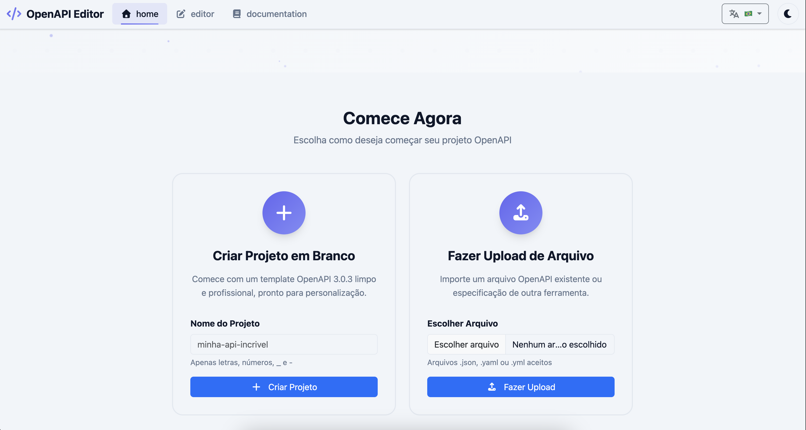
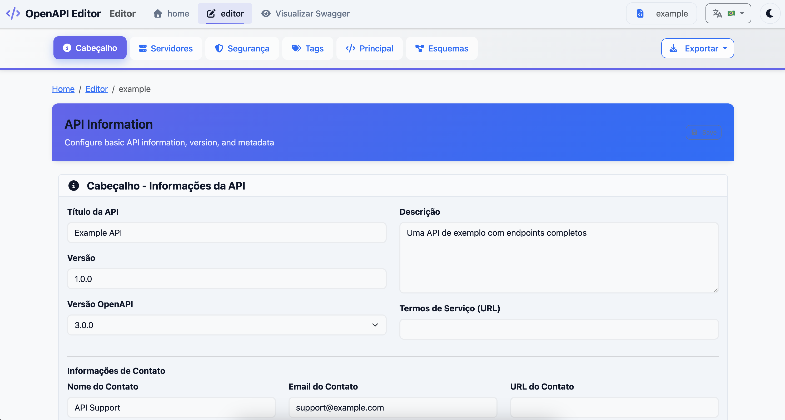

# 🚀 OpenAPI Editor

<div align="center">

**Sistema completo de edição e visualização de documentações OpenAPI/Swagger**

[](https://openapi.myrotech.com)
[](LICENSE)
[](https://php.net)
[](https://developer.mozilla.org/en-US/docs/Web/JavaScript)

</div>

## 📸 Screenshots

### 🏠 **Página Principal**


### ✏️ **Editor OpenAPI**


## 🌐 **Sistema Online**

🔗 **Acesse agora:** [https://openapi.myrotech.com](https://openapi.myrotech.com)

## ✨ Recursos Principais

- 📝 **Editor OpenAPI** - Syntax highlighting e validação em tempo real
- 👁️ **Preview Swagger UI** - Interface integrada e responsiva  
- 🔍 **SEO Otimizado** - Schema.org, Open Graph e Twitter Cards
- 🛡️ **Segurança Robusta** - Configurações de produção
- 🎨 **Interface Moderna** - Design responsivo e acessível

## 🚀 Início Rápido

```bash
# 1. Configure o ambiente
cp .env.example .env
# Edite o .env com suas configurações

# 2. Instale dependências  
npm install && npm run build

# 3. Acesse o sistema
# Editor: /editor.php
# Preview: /preview.php
```

## 📚 Documentação

| Categoria | Links |
|-----------|-------|
| **🏗️ Setup** | [Instalação](docs/installation.md) • [Configuração](docs/configuration.md) • [Deploy](docs/deployment/) |
| **💻 Desenvolvimento** | [Guia Técnico](docs/TECHNICAL_GUIDE.md) • [Contribuição](docs/CONTRIBUTING.md) • [Roadmap](docs/BACKLOG.md) |
| **🛡️ Segurança** | [Configurações](docs/security/) • [Alertas](docs/security/SECURITY_ALERT.md) |
| **📈 Atualizações** | [Melhorias](docs/IMPROVEMENTS.md) • [Changelog](docs/CHANGELOG.md) |

## 🛠️ Stack Tecnológico

**Frontend:** HTML5, CSS3, JavaScript ES6+, SCSS  
**Backend:** PHP 8.0+, Apache/Nginx  
**Libraries:** Swagger UI, CodeMirror, Schema.org  
**Build:** Gulp, npm/Composer

## 📞 Suporte

- 🐛 **Bugs:** Use os [templates de issue](.github/ISSUE_TEMPLATE/)
- 💡 **Sugestões:** Abra uma [feature request](.github/ISSUE_TEMPLATE/feature_request.md)  
- 🤝 **Contribuir:** Leia o [guia de contribuição](docs/CONTRIBUTING.md)

## 📄 Licença

[MIT License](LICENSE)

## 👨‍💻 Autor

<div align="center">

**Desenvolvido com ❤️ por [Myrotech](https://myrotech.com)**

[](https://myrotech.com)
[](mailto:suporte@myrotech.com)

---

### 🤝 **Contribuições**

Este projeto é open source e contribuições são sempre bem-vindas!

- 🐛 **Reporte bugs** usando os [templates de issue](.github/ISSUE_TEMPLATE/)
- 💡 **Sugira melhorias** através de [feature requests](.github/ISSUE_TEMPLATE/feature_request.md)
- 🔧 **Contribua com código** seguindo nosso [guia de contribuição](docs/development/CONTRIBUTING.md)

### ⭐ **Apoie o Projeto**

Se este projeto foi útil para você, considere:
- ⭐ Dar uma estrela no repositório
- 🔄 Compartilhar com outros desenvolvedores
- 💬 Deixar feedback nas issues

</div>